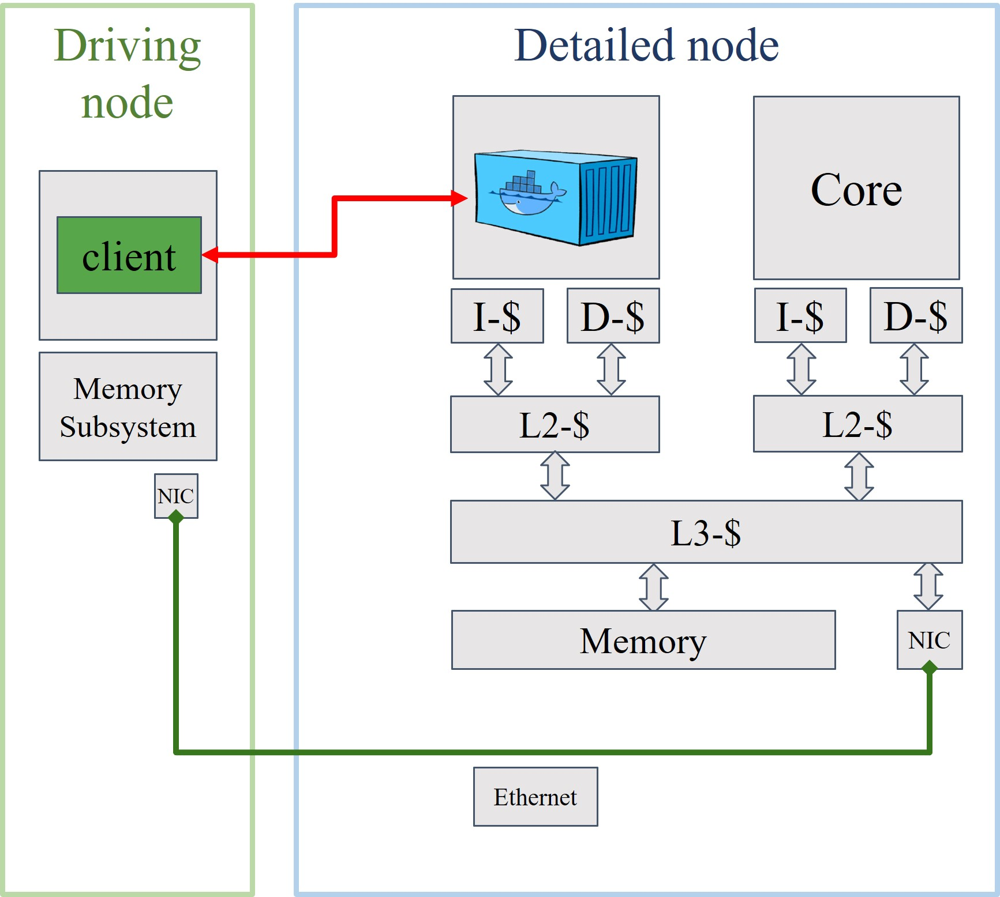

# **vSwarm-&mu;:** Microarchitectural Research for Serverless

## Build tests
[](https://github.com/ease-lab/vSwarm-u/actions/workflows/build_kernel.yml)
[](https://github.com/ease-lab/vSwarm-u/actions/workflows/build_gem5.yml)
[](https://github.com/ease-lab/vSwarm-u/actions/workflows/create_base_disk.yml)
[](https://github.com/ease-lab/vSwarm-u/actions/workflows/function_ci.yml)

[](https://opensource.org/licenses/MIT)
<a href="https://twitter.com/intent/follow?screen_name=ease_lab" target="_blank">
</a>


<!--  -->

> **Warning**
> *vSwarm-u is still in beta state but will be released soon for the ISCA'22 conference.*

## Mission

Serverless computing has emerged as a widely used paradigm for deploying services in the cloud. In serverless, developers organize their application as a set of functions, which are invoked on-demand in response to a trigger, such as user request or an invocation by another function.

Recent studies of production data  reveal drastic differences in the characteristics of serverless workloads compared to conventional cloud workloads: short execution time and infrequent invocation of function instances. Performance studies  further finds that serverless workloads are inefficient when running on modern CPUs designed for traditional long-running workloads. To make serverless workload execution efficient, there is a strong need to understand more about the detailed implications serverless workload characteristics have on modern hardware.

However, existing platforms that support the required level of detail make significant simplifications in the test setup and the software stack to achieve feasible simulation times. Prior work often lacks the key layers of the serverless software stack, such as containerization and HTTP-level communication fabric, to simplify and increase the simulation speed. However, the short execution time of serverless functions leads to a significant fraction of execution time spent in system layers. Such simplifications may result in wrong experimental data and, consequently, mislead the systems researchers.

With vSwarm-&mu; we are addressing the challenges of serverless host server simulation and allow researchers to conduct experiments with systems representative of a modern serverless cloud. To achieve this, the vSwarm-u framework integrates various serverless workloads packages as containerized functions and featuring the full communication stack with gem5, the state-of-the-art research platform for system- and microarchitecture. This allows researcher to perform cycles accurate simulation of the representative serverless software stack in gem5’s full system mode.

Furthermore, vSwarm-u includes the infrastructure to drive function instances running on the simulated serverless host server without interfering or simplifying the complexity of the test system. The robust evaluation methodology allows benchmarking and microarchitecture analysis in a realistic scenario.

## vSwarm-u Design


## Referencing our work

If you decide to use vSwarm-&mu; for your research and experiments, we are thrilled to support you by offering
advice for potential extensions of vSwarm-&mu; and always open for collaboration.

Please cite our [paper](https://ease-lab.github.io/ease_website/pubs/JUKEBOX_ISCA22.pdf) that has been recently accepted to ICSA 2022:

<!--
```
@inproceedings{schall:lukewarm,
  author    = {David Schall and
               Artemiy Margaritov and
               Dmitrii Ustiugov and
               Andreas Sandberg and
               Boris Grot},
  title     = {Lukewarm Serverless Functions: Characterization and Optimization},
  booktitle = {2022 ACM/IEEE 49th Annual International Symposium on Computer Architecture (ISCA)},
  publisher = {{ACM}},
  year      = {2022},
  doi       = {10.1145/3470496.3527390},
}
``` -->


## Getting started with vSwarm-&mu;

vSwarm-&mu; can be deployed on premises or in the cloud, with support for nested virtualization. We provide [a quick-start guide](docs/quickstart_guide.md)
that describes the intial setup, as well as how to set up benchmarking experiments.

You can view the vSwarm-&mu; documentation [here](docs/).


### Getting help and contributing

We would be happy to answer any questions in GitHub Issues and encourage the open-source community to submit new Issues, assist in addressing existing issues and limitations, and contribute their code with Pull Requests.


## License and copyright

vSwarm-&mu; is free. We publish the code under the terms of the MIT License that allows distribution, modification, and commercial use.
This software, however, comes without any warranty or liability.

The software is maintained at the [EASE lab](https://easelab.inf.ed.ac.uk/) as part of the University of Edinburgh.


### Maintainers

* David Schall: [GitHub](https://github.com/dhschall), [web page](https://dhschall.github.io/)


## Directory Structure

- `simulation` contains everything related to run simulations.
- `setup` contains all scripts and makefiles to setup vSwarm-u
- `tools` includes a client that can be instrumented for gem5
- `runner` is for setting up self-hosted GitHub Actions runners.
- `docs` contains the documentation on a number of relevant topics.


## Known problems

Sometimes the simulator get stuck during while running with the detailed core model. We are working on it and try to make the setup more stable.
In the meantime the best is to kill the process and restart the simulation for this particular funtion.
Use
```bash
make -f simulation/Makefile kill_gem5
```
to kill all currently running simulations at once.


