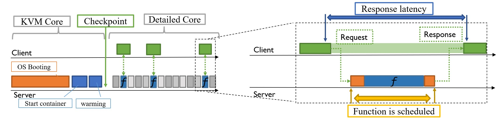

# Workload Instrumentation
{: .no_toc }

  

    Table of contents
  

  {: .text-delta }
1. TOC
{:toc}

---

In contrast to conventional workloads serverless function run for very short amount of time. The challenge for those kind of workloads however that due to the short nature the interval where do measurements need to be defined more precise.

<figure>
  
    <figcaption> <i><b>Figure 1:</b> Overall simulation flow and several intervals to be measured.</i></figcaption>
</figure>

Figure 1 show the the overall simulation and different interval that are interesting to do measurements. The following describe how different points in this flow are instrumented.

## M5 Fail codes
For driving the simulator fail codes are executed at various points during the simulation.  via the m5 binary

## Instrumented go client.
Using the `m5` binary is fine for rough trigger points. However, it is not very precise as some OS interaction is involved when executing a command. (Need to load the binary, allocate memory,...)

In order to get around this and get more precise trigger points the repo includes a instrumented to client. Under to hood it takes advantage of the [`m5ops`]() magic instruction