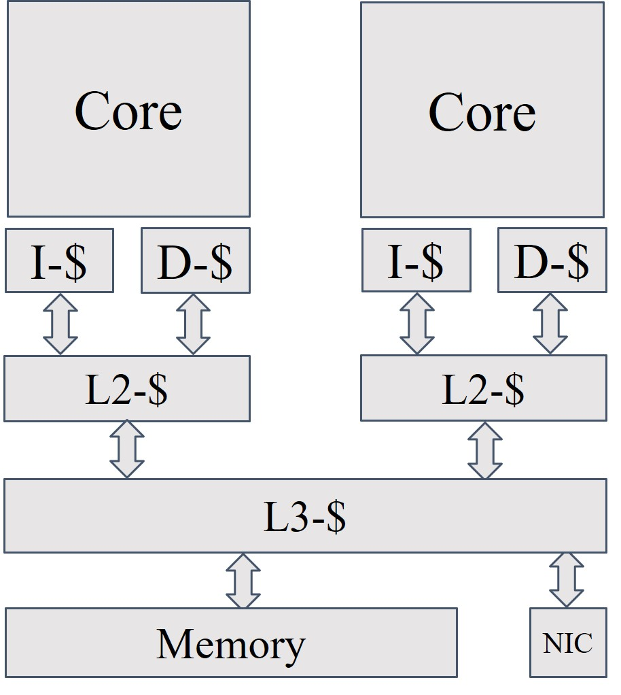
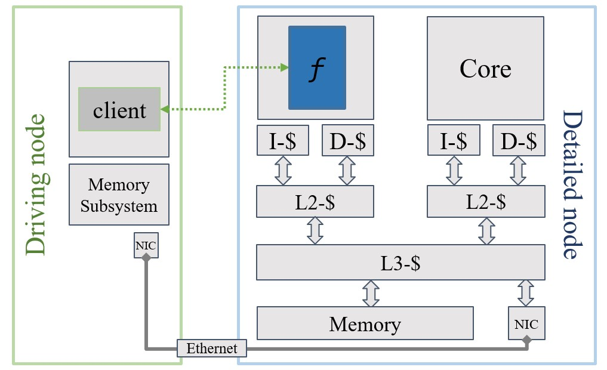

# Simulated Systems Models

At the moment we provide two systems setups ready to use. A simple and a complex model. The complex system is base on Intel Skylake parameters and was adopted from [here](https://github.com/darchr/gem5-skylake-config)

In the following the two systems and the main parameters. For all details refer to the configs in `gem5utils/systems/`.

### Simple System

|  | Parameters |
|---|---|
| | **Core:** TimingSimpleCPU  **L1-I/D:** 32KB  **LLC:** 128KB **Memory:** 2GB

### Complex Skylake System

The complex model is the Intel Skylake CPU and its parameters are taken from the reference setup in [here](https://github.com/darchr/gem5-skylake-config).

|  | Parameters |
|---|---|
| | **Core:** Intel Skylake  **L1-I/D:** 32KB  **L2: 1MB**   **LLC:** 8MB **Memory:** 2GB, DDR4, 2400, 16x4.

## Two Machine Model
For a truly isolated server-client communication we also provide a two machine setup. In order to use it build our initial working directory with `make -f simulation/Makefile build-two-machine` setup. The only difference is that it will use a different template to create the `run_sim.py` config file

|  | Parameters |
|---|---|
| | **Detailed Node:** Skylake system model     **Driving Node:** TimingSimpleCPU, 8MB LLC, 2GB SimpleMemory |